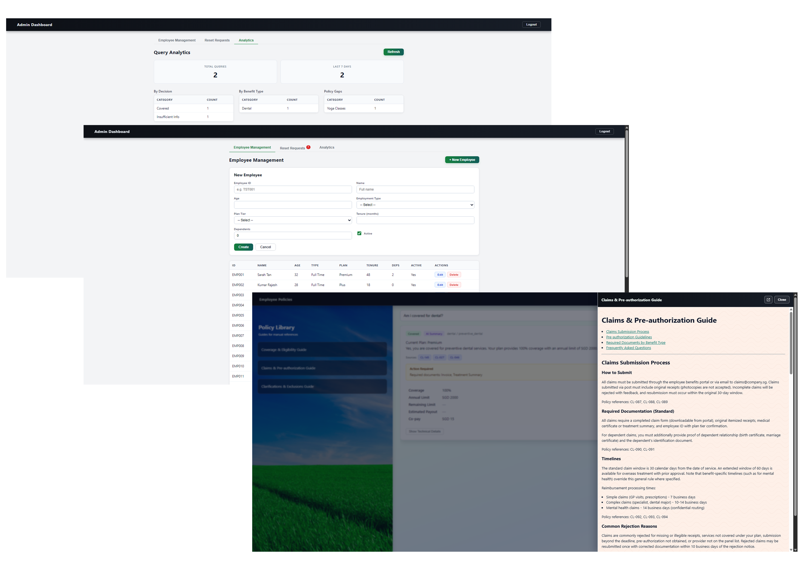

# Corporate Health Benefits Navigator

A rules-first decision-support system that helps employees understand corporate health benefit coverage, with validated AI explanations and HR operational workflows.

---

## Overview

The Corporate Health Benefits Navigator (CHBN) is a full-stack decision-support application built to address a common but costly enterprise problem: employees misunderstanding their health benefit coverage, leading to avoidable claim rejections, repeated HR clarification cycles, and friction at the point of care. The system allows employees to ask plain-language questions about outpatient, dental, and mental health benefits and receive immediate, explainable, auditable answers grounded in policy rules — not guesswork. Coverage decisions are made by a deterministic rules engine; a multi-agent LLM pipeline (explainer → critic → safety gate) then generates a validated plain-language explanation with policy citations. HR admins manage employee records, password resets, policy reindexing, and review anonymised usage analytics from a dedicated dashboard. Built as a local-first MVP using synthetic data, with a full AWS cloud deployment path.

<p align="center">
  
</p>
<p align="center">
  <em>Representative product surfaces across employee decision support, policy guidance, HR administration, and analytics workflows.</em>
</p>

---

## Why This Project Matters

In organisations with complex tiered health benefit programs, the gap between what is written in a policy document and what an employee actually understands creates real operational cost. HR teams spend significant time repeating eligibility clarifications, correcting misinformed claims, and managing escalations that should never have reached them. Employees, in turn, delay or forego care because they cannot quickly determine whether something is covered.

A self-service guidance tool addresses this — but only if it is trustworthy. A system that sometimes gives the right answer is worse than no system at all, because it shifts liability onto employees acting on incorrect guidance. This project is built around that constraint: decisions must be deterministic, explainable, and auditable. The AI layer is always subordinate to the rules engine, and every explanation is validated before it reaches the user.

---

## Users and Workflows

### Employee
- Logs in with a verified employee ID and password
- Asks plain-language questions about coverage (e.g. "Is my root canal covered?", "Do I need pre-authorisation for an MRI?")
- Receives a coverage decision tailored to the employee’s plan tier and profile, including financial details, required documents, pre-authorisation requirements, and a validated AI-generated plain-language summary with policy citations
- Accesses a Policy Library with guide cards covering Coverage & Eligibility, Claims & Pre-authorisation, and Exclusions & Clarifications
- Submits a password reset request if locked out; completes a forced password change on first login

### HR Admin
- Logs in with a separate admin credential path enforced by RBAC
- Manages the full employee roster: create, read, update, delete with field validation and modal confirmations
- Reviews pending password reset requests; approves them by issuing a temporary password or rejects them through the admin workflow
- Views anonymised usage analytics: total queries, last-7-days volume, breakdowns by benefit type and decision outcome
- Monitors a Policy Gaps table — when employee queries return no policy match, an LLM extracts the anonymous topic (e.g. "Yoga Classes", "Weight Management") so HR can identify coverage gaps
- Triggers a policy index rebuild when policy documents change

---

## Solution Overview

CHBN is structured as a rules-first decision-support system with an AI explainability layer on top. The architecture is deliberately layered so that the deterministic decisions are never exposed to model influence — the LLM is brought in only after the decision is locked.

```
Employee query
      │
      ▼
Rules Engine ──── single source of truth for coverage decision
      │
      ▼
Policy Retriever ── fetches relevant policy clauses for citation
      │
      ▼
Explainer Agent ── generates plain-language summary from decision + citations
      │
      ▼
Critic Agent ──── validates summary consistency with deterministic decision
      │
      ▼
Safety Gate ───── confirms AI output aligns with rule keywords before release
      │
      ▼
Response ──────── decision + financial details + validated AI summary + citations
```

This architecture means the LLM cannot override, contradict, or soften a coverage decision. If the LLM fails or produces an inconsistent output, the system degrades gracefully to a rule-only response — the coverage decision is always served.

---

## Key Product Capabilities

**Decision and query**
- Rules-first coverage decisions across outpatient, dental, and mental health benefits
- Employee-level eligibility evaluation: plan tier, employment type, tenure, active status
- Pre-authorisation requirements and required documentation surfaced per query
- Financial details: coverage percentage, annual limits, co-pay, estimated payout

**AI explainability**
- Validated plain-language summaries generated by an LLM explainer agent
- Critic agent validates consistency between the AI summary and the deterministic decision
- Safety gate checks AI output against rule keywords before response release
- Policy citations included in every response with traceable clause IDs
- Graceful degradation: AI summary is nullable — coverage decision always returns

**Admin and HR workflows**
- Full employee CRUD with field validation, modal popups, and formatted display labels
- Password reset queue: request flow, HR approval/rejection, temp password generation with copy-to-clipboard
- Forced password change flow on first login or HR-initiated reset
- Policy index rebuild trigger from admin dashboard

**Analytics**
- Anonymous query logging (no employee PII stored) to a `query_logs` DB table
- Admin Analytics tab: total queries, last-7-days count, breakdown by decision and benefit type
- Policy Gaps table: LLM-extracted benefit topics from unrecognised queries, ranked by frequency

**Policy Library**
- Sidebar with three policy guide cards: Coverage & Eligibility, Claims & Pre-authorisation, Exclusions & Clarifications
- Slide-in markdown guide drawer with anchor navigation and open-in-new-window support

**Infrastructure and deployment**
- Local Docker Compose with PostgreSQL and auto-seeding on startup
- AWS ECS Fargate + RDS PostgreSQL + Terraform IaC (persistent/demo split lifecycles)
- Deploy-on-demand GitHub Actions workflow with OIDC — ~$0 when off

---

## Architecture and Decisioning Approach

### Rules engine as the authority

The rules engine (`rules_engine.py`) is the single source of truth for every coverage decision. It evaluates a structured rule table against employee attributes (plan tier, employment type, tenure, dependents, active status) and returns a deterministic outcome: `covered`, `not_covered`, `preauth_required`, or `insufficient_info`. This file is frozen — it is never modified as part of orchestration, LLM integration, or UI changes. No-drift regression gates in CI verify this on every run.

### Orchestration pipeline (LangGraph)

The `POST /v1/query-orchestrated` endpoint runs a LangGraph state graph with four nodes:

1. **Rules engine node** — executes deterministic evaluation; result is locked before any other node runs
2. **Retriever node** — fetches top-k policy document chunks by semantic similarity to the query, returning citation-ready clause references
3. **Explainer node** — calls the LLM with the locked decision, employee context, and retrieved policy citations to generate a plain-language summary
4. **Critic node** — re-evaluates the explainer output for consistency with the deterministic decision; triggers a retry loop if inconsistent, then falls back to a structured template if retries are exhausted
5. **Safety gate** — performs a final keyword check on the AI summary against the rule decision before the response is assembled

The original `/v1/query` endpoint remains a stable, LLM-free route with an unchanged contract — used by tests and as a fallback reference.

### Why the LLM cannot override decisions

The explainer node receives the decision as an input fact, not as something it is asked to evaluate. The critic and safety gate are post-generation validators, not alternative decision paths. If both fail, the system falls back to a deterministic structured response. This means an LLM hallucination can be caught and suppressed before reaching the employee — the worst case is a less rich explanation, not an incorrect coverage decision.

---

## Security, Governance, and Reliability

Security was treated as a core system requirement from Phase 7 onward.

**Authentication and authorisation**
- JWT authentication with full claims validation (`sub`, `role`, `exp`, `iat`, `aud`)
- RBAC enforcement matrix: employee queries require employee or hr_admin role; admin endpoints require hr_admin only; health and auth endpoints are public
- DB-backed bcrypt password storage; demo credential fallback in development mode only
- Startup secret validation: application refuses to start in non-dev mode with `change_me` secrets

**Input and output security**
- `QueryRequest` input validation: `employee_id` pattern-matched (`^[A-Z]{2,5}\d{1,6}$`), `question` capped at 500 characters, extra fields forbidden
- Prompt injection guardrails: known injection patterns stripped before LLM calls
- File path sanitisation on `decision_path` outputs
- Safe error handling: global catch-all returns `INTERNAL_ERROR` with no stack traces exposed

**Network and operational security**
- CORS strict allowlist (environment-aware; `*` only in development)
- Rate limiting on query endpoints via `slowapi` (30 requests/minute default); custom `RATE_LIMIT_EXCEEDED` response
- Log sanitisation middleware scrubs JWT tokens, passwords, and API keys from all log records
- Secrets management: `DATABASE_URL` and `OPENAI_API_KEY` injected via AWS SSM SecureString into ECS — never in plaintext environment variables or logs
- OIDC authentication for GitHub Actions — no long-lived AWS credentials stored

**Reliability and drift prevention**
- `REPO_MODE` safety switch: `csv_only` bypasses DB entirely for safe rollback; `db_only` enforces DB with fast-fail; `dual` (default) uses DB-first with structured CSV fallback
- No-drift golden output gate in CI: 30 eval cases run deterministically (LLM disabled) on every push; CI fails if any case regresses
- DB parity tests: CSV and DB-backed repositories validated to produce identical outputs
- SHA-tagged Docker images: `:latest` never used for ECS deployments; every deploy is pinned to a specific Git SHA

---

## Delivery and Execution Evidence

This project was developed across 17 phases in approximately six weeks, from an empty repository to a cloud-deployable system. Each phase was scoped to a specific capability increment, frozen with a checkpoint tag, and validated before the next phase began.

| Phase | Capability delivered |
|-------|---------------------|
| 1 | Deterministic rules engine + `/v1/query` endpoint |
| 2 | Policy retrieval (chunking, embedding index, citation-ready hits) |
| 3 | LangGraph orchestration pipeline + `/v1/query-orchestrated` |
| 4 | React frontend integration with results UI |
| 5 | Deterministic eval harness (15 golden cases, timestamped artifacts) |
| 6 | PostgreSQL persistence, Alembic migrations, no-drift gate, fallback repos |
| 7 | Full security hardening: JWT, RBAC, rate limiting, prompt injection guards, log sanitisation |
| 8 | Multi-agent pipeline: explainer, critic, safety gate; OpenAI embeddings |
| 9 | Branded login page, policy library sidebar, guide drawer, UX redesign |
| 10 | HR admin dashboard: employee CRUD, admin login, RBAC-gated routes |
| 11 | Password authentication: bcrypt, forced reset flow, HR reset queue |
| 12 | AWS cloud deployment: ECS Fargate, RDS PostgreSQL, Terraform IaC |
| 13–14 | CI/CD hardening: SHA-tagged images, OIDC deploy workflow, Terraform fixes |
| 15 | Cloud RAG fixes, cosmetic exclusion rule gaps closed (52 rules), LLM prompt quality |
| 16 | Eval suite expansion: 30 golden cases, CI gate, human eval scorecard (90% pass rate) |
| 17 | HR analytics dashboard, anonymous query logging, Policy Gaps analysis |

**Testing scale:** 327 automated tests across 24 test files. Test layers include unit tests (rules engine, chunker, query parser), integration tests (all API endpoints), security tests (JWT lifecycle, RBAC, rate limiting, CORS, prompt injection, logging hygiene, secrets hygiene), DB parity tests, no-drift golden output gates, and a deterministic eval harness wired into CI.

**Human eval:** 10-case human review run completed at v0.17.0; 9/10 cases passed (90% pass rate). One P0 finding documented and tracked for future fix.

---

## Tech Stack

| Layer | Technology |
|-------|-----------|
| Backend API | FastAPI (Python 3.11) |
| Orchestration | LangGraph |
| LLM and embeddings | OpenAI API (GPT-4 class; text-embedding-3-small) |
| Frontend | React 19 / Vite 5 |
| Database | PostgreSQL 16 + SQLAlchemy 2.0 + Alembic |
| Auth | JWT (PyJWT) + bcrypt |
| Rate limiting | slowapi |
| Containerisation | Docker Compose (local) + Docker multi-stage builds |
| Cloud infrastructure | AWS ECS Fargate, RDS PostgreSQL, ALB, ECR |
| IaC | Terraform (7 modules: ECR, IAM, SSM, VPC, ALB, ECS, RDS) |
| CI/CD | GitHub Actions (CI test suite + deploy-on-demand with OIDC) |

---

## Repository Structure

```
corporate-health-benefits-navigator/
├── backend/
│   └── app/
│       ├── api/           # FastAPI routes (query, auth, admin, analytics)
│       ├── auth/          # JWT handler, RBAC, password utils, dependencies
│       ├── db/            # SQLAlchemy session, models, init/seed logic
│       ├── middleware/    # Error handler, log sanitiser
│       ├── orchestration/ # LangGraph graph, nodes, state
│       └── services/      # Rules engine, retriever, employee/rule repos, input sanitiser
├── frontend/
│   ├── src/               # React SPA (pages, components, styles)
│   └── public/guides/     # Policy guide markdown files
├── data/
│   ├── raw/policies/      # Policy corpus (8 synthetic policy documents)
│   ├── rules/             # benefit_rules.csv (52 rules)
│   ├── fixtures/          # employees.csv (26 synthetic employees)
│   └── index/             # Pre-built embedding index (chunks, embeddings, meta)
├── tests/                 # 327 tests across 24 files
├── eval/                  # 30 golden eval cases, human eval scorecard, artifacts
├── scripts/               # build_index, run_eval, seed scripts, readiness report
├── terraform/
│   ├── persistent/        # ECR, IAM, SSM (long-lived resources)
│   ├── demo/              # VPC, ALB, ECS, RDS (ephemeral; fully destroyable)
│   └── modules/           # 7 reusable Terraform modules
├── .github/workflows/     # CI test suite + deploy-on-demand workflow
└── docs/                  # Deployment docs, testing strategy, runbooks, and README assets
```

---

## Setup — Local Development

**Prerequisites:** Docker Desktop, Python 3.11+, Node 20+

**1. Configure environment**
```bash
cp .env.example .env
# Edit .env: set OPENAI_API_KEY, JWT_SECRET
# LLM_ENABLED=false for offline mode (rules engine and retrieval still work)
```

**2. Build the embedding index** (required for policy citations)
```bash
python scripts/build_index.py
```

**3. Start all services**
```bash
docker compose up --build
```

**4. Access**
- Frontend: `http://localhost:5173`
- API docs: `http://localhost:8000/docs`
- Demo credentials: employee `EMP001` / `EMP002` / `EMP003`, HR admin `HR001`

**5. Run tests**
```bash
python -m pytest tests/ -v
```

**6. Run the eval harness** (requires live backend on port 8000)
```bash
python scripts/run_eval.py --timeout 60
```

---

## Deployment Overview

CHBN runs on AWS ECS Fargate with a deploy-on-demand model — infrastructure spins up for a demo and tears down cleanly afterwards. Cost is ~$0.90/day running (CSV-only mode) or ~$1.25/day (with RDS), and ~$0.50/month when off (ECR image storage only).

**Infrastructure layout (two independent Terraform state files):**
- `terraform/persistent/` — ECR repositories, IAM roles, SSM parameters. Long-lived; survives demo teardowns.
- `terraform/demo/` — VPC, ALB, ECS Fargate cluster and services, RDS (optional). Fully destroyable.

**Deployment modes:**
- **CSV-only** (default): API boots without a database; policy retrieval and rules engine run from bundled files. Suitable for demos.
- **RDS-enabled** (`enable_rds=true`): PostgreSQL 16.4 on `db.t3.micro` in private subnets. DB auto-initialised and seeded on first boot. CRUD operations persist across task restarts.

**Deploy-on-demand workflow (GitHub Actions):**
- Manual trigger (`workflow_dispatch`) — build and push images to ECR; optionally deploy to ECS
- OIDC authentication — no long-lived AWS credentials in GitHub secrets
- Images tagged with the Git SHA — never `:latest`

```bash
# Spin up (CSV-only demo)
cd terraform/demo && terraform apply

# Tear down
cd terraform/demo && terraform destroy
```

Full runbook with first-time setup, RDS mode, smoke tests, seeding, and cost guardrails: [`docs/DEPLOYMENT.md`](docs/DEPLOYMENT.md)

---

## Current Limitations

- **Synthetic data only.** All employees, policy documents, and benefit rules are fictitious. The rules and policies do not correspond to any real insurer, employer, or jurisdiction.
- **MVP policy scope.** Three benefit types: outpatient, dental, mental health. No claims processing, no insurer API integration, no real-time eligibility lookup.
- **No email or SMS.** The password reset flow is HR-managed. There is no self-service email reset path.
- **Single-region deployment.** Terraform targets `ap-southeast-1`. Multi-region support is not implemented.
- **Demo-grade auth in development mode.** `APP_ENV=development` allows demo credential bypass; production hardening requires `APP_ENV=production` and a strong `JWT_SECRET`.
- **No HTTPS in the cloud deployment.** The ALB terminates HTTP. A custom domain with ACM TLS is not configured.
- **Frontend tests are manual.** There is no automated frontend test framework; validation relies on the `frontend/SMOKE_TEST.md` checklist.
- **Layer 2 LLM quality metrics deferred.** DeepEval integration (requiring live LLM API calls in CI) is not implemented.

---

## Future Improvements

- **HTTPS and custom domain** — ACM certificate + Route 53 alias record on the ALB
- **Additional benefit types** — hospitalisation, specialist, vision, preventive care
- **Real-time plan tier resolution** — integrate with HRMS to derive employee attributes at query time rather than from seeded fixtures
- **Multi-language support** — policy guide and summary translation for multilingual workforces
- **Deeper LLM quality gates** — DeepEval or equivalent for automated faithfulness, relevance, and hallucination scoring in a staging pipeline
- **Audit log and compliance export** — structured, tamper-evident query log export for compliance review
- **Proactive policy gap alerting** — scheduled digest to HR when the Policy Gaps table crosses a threshold for a specific topic
- **ECS auto-scaling and CloudWatch alarms** — task scaling policies and alarm thresholds for production readiness

---

## What This Project Demonstrates

**Product thinking applied to a real enterprise problem.** The project starts from an identifiable business cost — policy confusion, HR overhead, avoidable claim rejections — and works forward to a system design that addresses it specifically. Scope decisions throughout reflect that framing: features that did not serve employees or HR were deferred.

**Rules-first applied AI architecture.** The central design decision — deterministic rules engine as the authority, LLM as the explainer — is not incidental. It reflects a specific view of where AI can and cannot be trusted in a compliance-sensitive decision flow. The multi-agent critic and safety gate pattern is a practical implementation of that principle, not a theoretical one.

**Explainability and governance by default.** Every coverage response includes the decision basis, financial details, required documents, pre-authorisation requirements, policy citations, and a validated plain-language summary. The system is designed to be auditable: nothing opaque reaches the employee, and the decision path is always traceable.

**Security-aware delivery.** JWT, RBAC, rate limiting, prompt injection guards, log sanitisation, secrets management via SSM, and no-stack-trace error handling were implemented in a dedicated security phase before the system went near cloud infrastructure — not patched in afterwards.

**Full-stack execution discipline.** The project spans backend API, orchestration pipeline, embedding index, relational persistence, authentication flows, frontend SPA, admin workflows, HR analytics, cloud infrastructure (Terraform), CI/CD, and a test suite across all layers. The CHANGELOG documents every phase decision, the rationale behind it, and what was frozen. 327 tests and 30 golden eval cases with CI regression gates are unusually thorough for a solo portfolio project at this scope.

---

> **Note:** This project uses fully synthetic data throughout. All employee records, policy documents, benefit rules, and coverage decisions are fictitious and created for demonstration purposes only. No real employer, insurer, or employee data is used or represented.

> Images: [Freepik](https://www.freepik.com)
